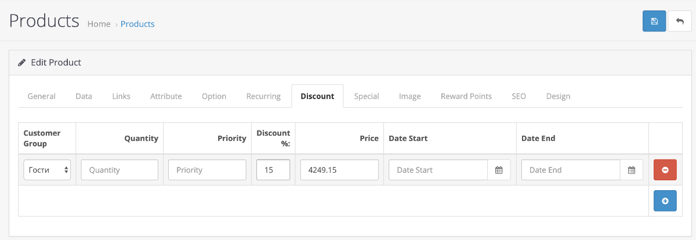

# FOC: Discount percent

Simple OCMod extension adding support for percentage discounts.

## How it works

On "Discount"/"Special" tabs you will see new column "Discount %"

When you set percents, neighbour field (*Price*) updates with discounted price value. Also when you change base price all discounts will be recalculated automaticaly.

> Based on "Percentage discounts" by Jorim van Hove
> If you looking version 1.5/2.x, please check original module @ [here](https://www.opencart.com/index.php?route=marketplace/extension/info&extension_id=19958), but pay attention that original module dont update discounts on changing product base price